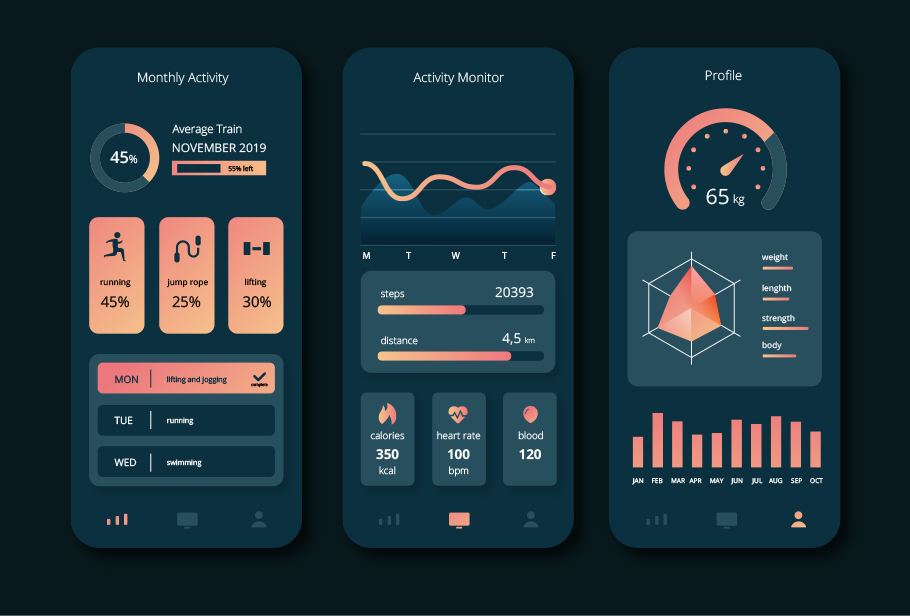

# 🛡️ IronCore Metrics

[](https://developer.android.com/about/versions/15)
[](https://store.google.com/product/pixel_10_pro)
[](https://developer.android.com/wear)
[](https://developer.android.com/cars/design/android-auto)

**IronCore Metrics** is a high-performance, AI-integrated health and fitness ecosystem designed for the modern athlete. Engineered specifically for the **Google Pixel 10 Pro XL**, **Wear OS**, and **Android Auto** (Hyundai Santa Fe integration), it provides a seamless, data-driven approach to training, nutrition, and recovery.

---

## 🚀 Key Capabilities

### 🧠 AI-Powered Intelligence
- **Homelab AI Backend:** Connects to your private Homelab (Ollama/Granite) for personalized meal plans and recovery advice.
- **Recovery Advisor:** Heuristic-based readiness scoring (%) that evaluates your physical state and suggests training intensity.
- **Dynamic HR Thresholds:** Real-time heart rate monitoring with automated safety alerts if thresholds are exceeded.

### 🏥 Health Connect Ecosystem
- **Centralized Data:** Seamlessly syncs Heart Rate, Steps, Active Calories, Weight, and Activity data.
- **Energy Balance:** Automatically calculates your Net Energy Balance by comparing Active Calories Burned (via Health Connect) with Calories Consumed (via local Nutrition tracking).

### ⌚ Wear OS & Ecosystem
- **Wrist-Based Tracking:** Real-time workout logging and heart rate monitoring on Wear OS.
- **Android Auto Integration:** View workout summaries and critical health alerts (Emergency HUD) directly on your Hyundai Santa Fe head unit while driving.
- **Media Control:** Integrated Spotify and YouTube Music controls for focused training sessions.

---

## ✨ Features

### 📊 Advanced Dashboard
- **Vitals at a Glance:** Real-time visualization of steps, heart rate, and weight.
- **Hydration Tracker:** Log water intake with a smart 2000ml daily target.
- **Active Energy HUD:** Circular progress visualization of your caloric balance.

### 🏋️ Workout Architecture
- **Surgical Tracking:** Detailed set/rep logging with historical volume analysis.
- **Recovery Coaching:** Proactive suggestions on when to push and when to rest based on physiological markers.

### 🚨 Safety & Monitoring
- **Vitals Monitor Worker:** Background WorkManager task (15-min intervals) monitoring for high-stress vitals (e.g., HR > 180 BPM).
- **Emergency Notifications:** CarAppExtender-enabled alerts that pop up on vehicle displays during critical health events.

---

## 🛠️ Technical Stack

- **UI:** Jetpack Compose & Compose for Wear OS (Material 3)
- **Architecture:** MVVM + Clean Architecture (Domain-driven)
- **Dependency Injection:** Hilt
- **Persistence:** Room (Offline-first architecture)
- **Networking:** Retrofit + OkHttp for AI Backend interaction
- **Background Tasks:** WorkManager for persistent vitals monitoring
- **Connectivity:** Health Connect Client & Android Auto Car App Library

---

## 🛠️ Setup & Configuration

1. **Prerequisites:**
   - Android Studio Jellyfish+
   - Android SDK 35 (VanillaIceCream)
   - Pixel 10 Pro XL (Target Device)

2. **AI Configuration:**
   - Update `NetworkModule.kt` with your Homelab AI API IP address.
   - Ensure your local Ollama instance is running the `granite-code` or equivalent model.

3. **Build:**
   ```bash
   # Use the project-specific gradle if system gradle is outdated
   ./gradlew assembleDebug
   ```

---

## 🎨 Visual Preview


*High-performance dashboard featuring GitHub Space Gray and IBM Cobalt Blue aesthetics.*

---

## 🔒 Privacy & Safety
IronCore Metrics is built with a **Privacy-First** philosophy. Your health data stays on your device (Room DB) and your private network (Homelab AI). No data is sold or sent to third-party advertisers.

---

## 📜 License
Personal Use License. High-performance metrics for high-performance individuals.
